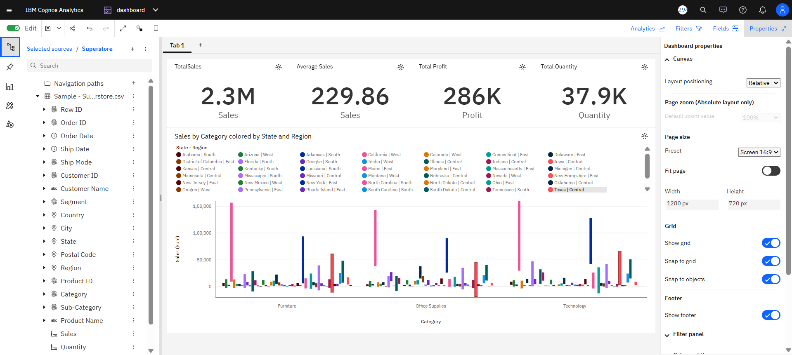

# 📊 IBM Cognos Analytics – Sales Performance & Regional Insights Dashboard

---

## 📌 Project Overview

This project demonstrates the use of IBM Cognos Analytics to analyze and visualize retail sales data. The dashboard transforms raw transactional data into meaningful insights through interactive visualizations and key performance indicators (KPIs).

The goal is to enable stakeholders to quickly understand business performance, identify trends, and make data-driven decisions.

---

## 🎯 Objectives

- Develop a structured data model for accurate reporting  
- Build interactive dashboards for business users  
- Analyze sales, profit, and regional performance  
- Extract actionable insights from data  
- Demonstrate BI tool proficiency  

---

## 🗂️ Dataset Information

- **Dataset Name:** Superstore Dataset  
- **Source:** (Add link here)  
- **Format:** CSV  
- **Domain:** Retail  
- **Rows:** ~9000+  
- **Columns:** ~20+  

### 📄 Description

This dataset contains transactional sales data including orders, customers, products, sales, profit, discount, quantity, and geographic information (region/state).

---

## 📊 Dashboard Features

- KPI Cards:
  - Total Sales  
  - Average Sales  
  - Total Profit  
  - Total Quantity  

- Column Chart:
  - Sales by Category  

- Color Segmentation:
  - Region / State  

- Interactive Features:
  - Filtering  
  - Drill-down  

---

## 📸 Screenshots

### 🔹 Dashboard Overview

> Add more screenshots inside the Screenshots folder if needed.

---

## 📈 Key Insights

- Technology category generates the highest sales  
- Sales performance varies across regions and states  
- High discounts reduce overall profitability  
- Some regions show strong revenue concentration  

---

## ⚙️ Tools & Technologies

- IBM Cognos Analytics  
- Data Visualization  
- Business Intelligence Reporting  

---

## ▶️ How to Use

1. Open the dashboard in Cognos  
2. Switch to **View Mode**  
3. Interact with charts:
   - Click to filter  
   - Hover for details  
4. Analyze KPIs and trends  

---

## 🚀 Future Improvements

- Add time-based analysis (monthly/yearly trends)  
- Improve visualization clarity  
- Add profit margin KPIs  
- Include advanced filters  

---

## 📜 License

This project is licensed under the MIT License.

---

## 👤 Author

**Vartika Gupta**  
- GitHub: https://github.com/vartikgupta01-blip 
- LinkedIn: https://www.linkedin.com/in/vartika-gupta-33b89820b/?skipRedirect=true

**Anshuman Yadav**  
- GitHub: https://github.com/Anshuman-Yadav18
- LinkedIn: https://www.linkedin.com/in/anshuman-yadav-21654024b?utm_source=share&utm_campaign=share_via&utm_content=profile&utm_medium=android_app
